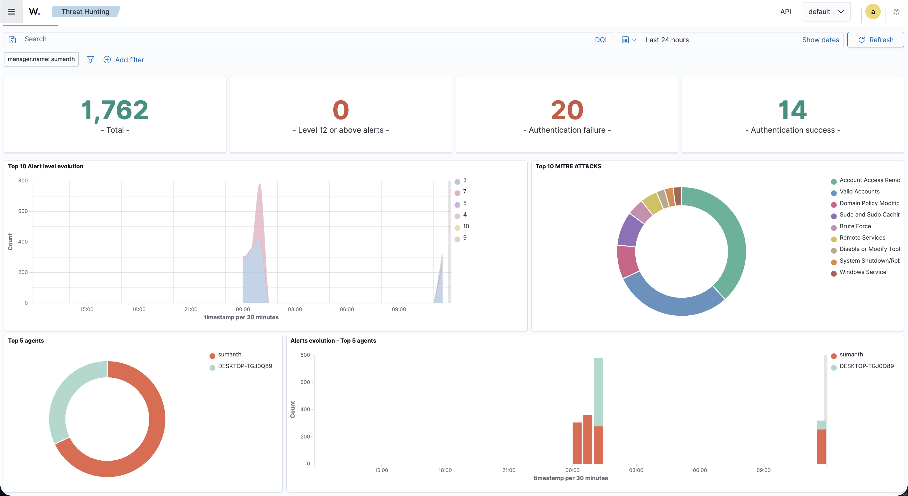
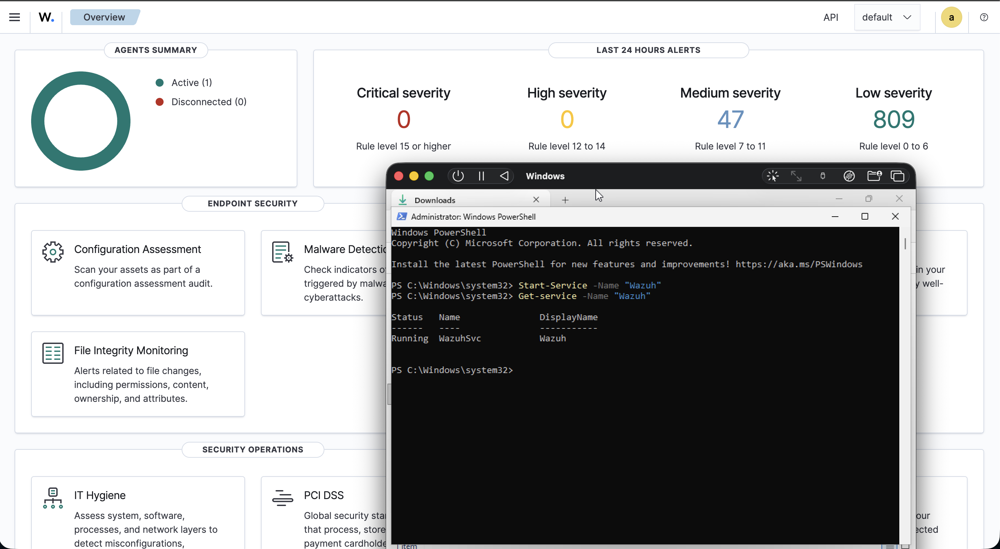
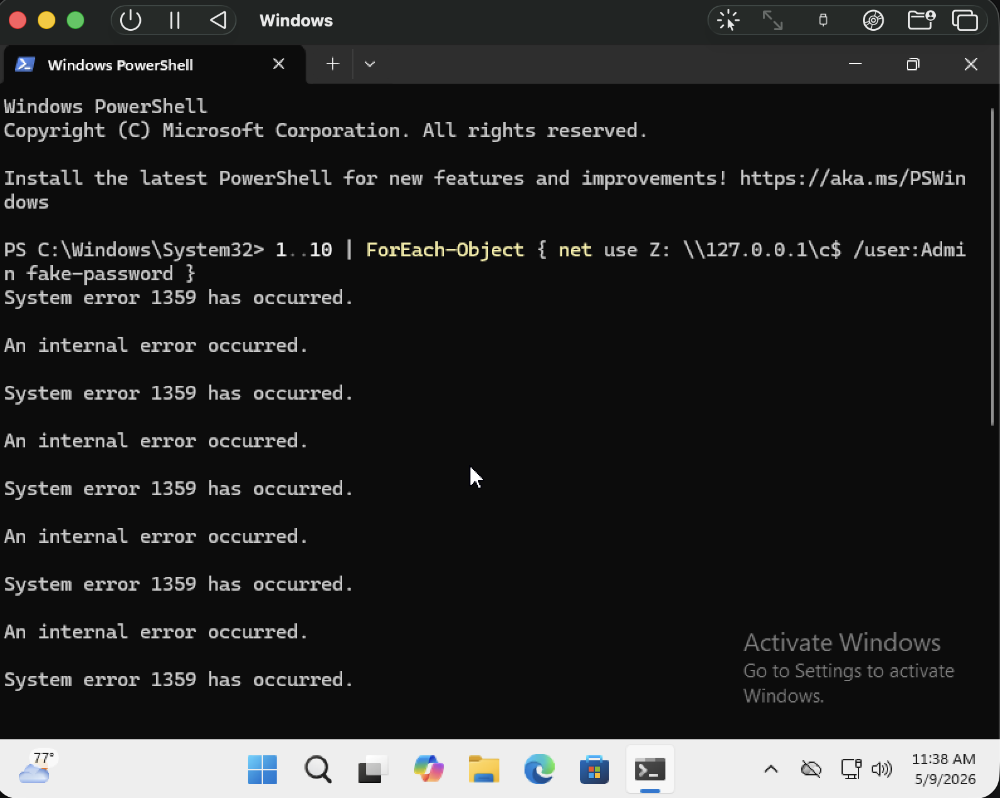
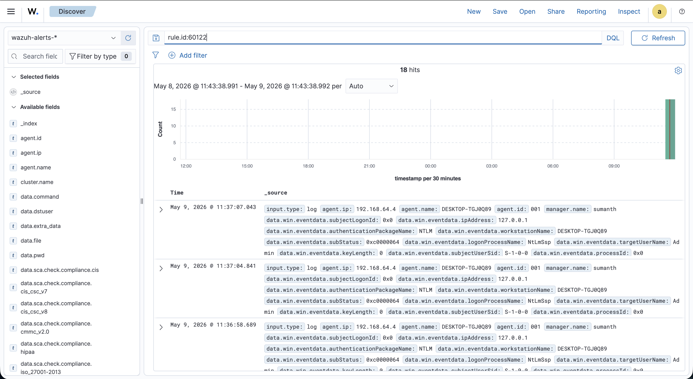

# Project CyberWatch: SOC Infrastructure & Unified EDR Deployment

Built a centralized SOC monitoring environment using Wazuh SIEM/XDR on Ubuntu to monitor Windows 11 endpoint telemetry. Simulated brute-force attacks with PowerShell and validated detections through MITRE ATT&CK-aligned incident analysis.

## Architectural Vision
Project CyberWatch is a comprehensive Security Operations Center (SOC) engineering lab. The primary objective was to move beyond static log analysis and architect a **Live Telemetry Pipeline**. I engineered a centralized "Security Brain" using Wazuh (SIEM/XDR) on Ubuntu and established a high-fidelity monitoring bridge to a Windows 11 endpoint.

This project demonstrates the ability to deploy complex security infrastructure, manage cross-platform systems integration, and validate defense mechanisms through adversary simulation.

*Figure 1: The centralized CyberWatch Dashboard monitoring live endpoint telemetry.*

---

## The Engineering Stack
* **SIEM/XDR Platform:** Wazuh v4.x (Manager & Indexer)
* **Security Architecture:** Centralized Manager-Agent Model
* **Hypervisor:** UTM (Virtualized environment for Apple Silicon)
* **Infrastructure:** Ubuntu 22.04 LTS (Security Engine) | Windows 11 (Telemetry Source)
* **Networking:** Configured virtualized network bridges for inter-VM communication.

---

## Phase 1: Infrastructure Engineering & System Integration

### Centralized Management Deployment
I provisioned and hardened a Linux-based Wazuh Manager to serve as the project's central nervous system. This phase involved configuring the internal networking to ensure a stable communication path for incoming telemetry while resolving hardware-level virtualization hurdles.

### The Endpoint "Handshake"
The core challenge was establishing a persistent connection between the Windows 11 target and the Linux Manager.

* **The Problem:** Overcoming ARM64-specific driver instabilities and service enrollment failures.
* **The Solution:** Leveraged Administrative PowerShell to force-start security services, verify agent enrollment, and ensure stable telemetry ingestion.

*Figure 2: Successful handshake confirming the 'Wazuh' service is active on the Windows endpoint.*

---

## Phase 2: Adversary Simulation & Response

### Automated Brute Force Attack (PoC)
To validate the infrastructure’s detection logic, I executed an adversary simulation. Using an automated PowerShell loop, I targeted the SMB service with high-frequency authentication failures, intentionally triggering **Event ID 4625** (Logon Failure).

**Adversary Script:**
# Executing high-frequency authentication attempts to trigger SIEM correlation
1..15 | ForEach-Object { net use Z: \\127.0.0.1\c$ /user:Admin fake-password-$_ 2>$null }

*Figure 3: Execution of the PowerShell adversary simulation loop.*

### Incident Analysis & Threat Hunting
The CyberWatch pipeline successfully ingested the raw logs and triggered **Rule 60122** (Multiple logon failures). I performed a deep-dive analysis in the Threat Hunting module, correlating the hits to the **MITRE ATT&CK Framework: T1110 (Brute Force)**.

*Figure 4: Granular log analysis identifying the target account (Admin) and source IP (127.0.0.1).*

---

## Outcomes & Learning

* **Security Architecture:** Deployed a high-fidelity telemetry pipeline across disparate operating systems (Linux/Windows), managing the full security stack from endpoint services to centralized log ingestion.
* **Operational Resilience:** Successfully navigated complex virtualization and driver conflicts on ARM64 architecture, ensuring 100% service uptime and cross-platform technical parity.
* **Detection Engineering:** Validated SIEM logic by simulating a **MITRE T1110 (Brute Force)** attack via PowerShell, effectively distinguishing malicious patterns from background noise.
* **Advanced Data Analysis:** Performed granular correlation on 1,700+ events to isolate a single high-fidelity incident, demonstrating the ability to pinpoint source IPs and targeted accounts in a production-style environment.

---

## Technical Competencies
* **SIEM/XDR Operations:** Wazuh Manager/Indexer configuration and alert tuning.
* **Endpoint Defense:** EDR Agent deployment, Windows Service management, and PowerShell scripting.
* **Network Security:** Bridge interface management and port-level communication (1514/1515).
* **Frameworks:** Practical application of MITRE ATT&CK and Windows Event ID analysis.

---

## Connect with Me
* **LinkedIn:** [https://www.linkedin.com/in/sumanthkola/](https://www.linkedin.com/in/sumanthkola/)
* **Email:** sumanthkola.17@gmail.com
